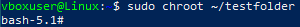

Урок 2. Механизмы контрольных групп

Задание 1:

запустить контейнер с ubuntu, используя механизм LXC

ограничить контейнер 256 Мб ОЗУ и проверить, что ограничение работает
 
добавить автозапуск контейнеру, перезагрузить ОС и убедиться, что контейнер действительно запустился самостоятельно
 
при создании указать файл, куда записывать логи
 
после перезагрузки проанализировать логи

Установим LXC и шаблоны

apt-get install lxc debootstrap bridge-utils lxc-templates

apt-get install lxd-installer

lxd init

Здесь просто нажимаем на Enter что уствновились значения по умолчанию

sudo apt update

Проверяем настройку lxc

Создаем контейнер

lxc-create -n test123 -t ubuntu

Запускаем его

lxc-start -n test123

Проверяем выделенную память

free -m

Выходим из контейнера

exit

Останавливаем контейнер

lxc-stop -n test123

Открываем файл конфига

nano /var/lib/lxc/test123/config

lxc.cgroup2.memory.max = 256M

lxc.rootfs.path = dir:/var/lib/lxc/test1234/rootfs

lxc.uts.name = test1234

Сохраняем, выходим, запускаем контейнер

lxc-start -n test123

